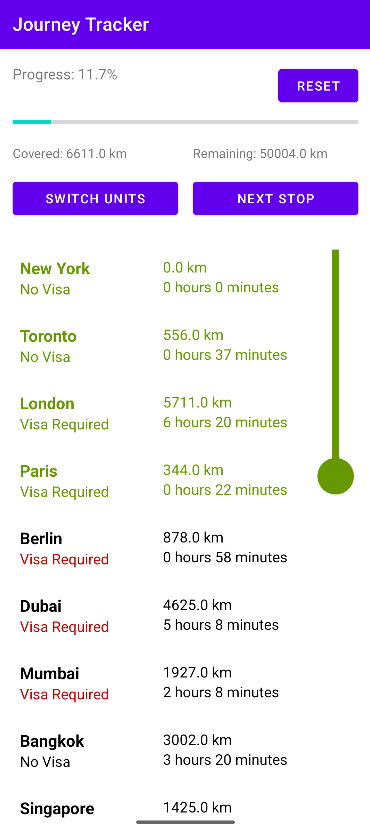

# JourneyTracker-XML

## Overview

This project is a Journey Tracker application built using the traditional Android View system with XML layouts and Kotlin. The app allows users to track their journey progress, switch between kilometers and miles, and reset the journey. The app also displays a list of stops with a progress arrow indicating the current position.

## Features

- **Journey Progress Tracking**: Displays the progress percentage and a progress bar.
- **Unit Switching**: Allows users to switch between kilometers and miles.
- **Reset Journey**: Resets the journey progress and scrolls back to the top.
- **Stops List**: Displays a list of stops with a progress arrow indicating the current position.
- **Auto-Scrolling**: Automatically scrolls to keep the current stop visible.

## Screenshots



## Installation

1. **Clone the repository and checkout to the XML/Kotlin branch**:
    ```sh
    git clone https://github.com/aryanGupta-09/MC_A1.git
    git checkout xml_kotlin
    ```
2. **Open the project**:
    - Open Android Studio.
    - Click on `File` -> `Open`.
    - Navigate to the cloned repository and select the project folder.
3. **Build and run the project**:
    - Connect an Android device or start an emulator.
    - Click on the `Run` button in Android Studio.

## Usage

1. **Track Progress**:
    - The app displays the journey progress percentage and a progress bar at the top.
    - The progress percentage is updated as you mark stops as visited.

2. **Switch Units**:
    - Use the "Switch Units" button to toggle between kilometers and miles.
    - The distance covered and remaining will be updated accordingly.

3. **Next Stop**:
    - Use the "Next Stop" button to mark the next stop as visited.
    - The progress percentage and progress bar will be updated.
    - The list will auto-scroll to keep the current stop visible.

4. **Reset Journey**:
    - Use the "Reset" button to reset the journey progress.
    - The progress percentage and progress bar will be reset.
    - The list will scroll back to the top.

## Code Structure

### Main Files

- **MainActivity.kt**:
    - The main activity that sets up the content and initializes the `JourneyManager`.
    - Handles the UI interactions and updates.

### UI Components

- **activity_main.xml**:
    - The main layout file defining the UI structure using XML.
    - Contains the progress section, distance information, buttons, and stops list.

- **item_stop.xml**:
    - The layout file defining the UI for each stop item.
    - Displays the stop name, visa requirement, and time to reach the stop.

- **progress_arrow.xml**:
    - The drawable file defining the progress arrow.
    - Displays a vertical progress indicator with a circle at the bottom.

### Data Management

- **JourneyManager.kt**:
    - Manages the journey data and progress.
    - Contains functions to mark the next stop, reset the journey, and calculate progress.

- **Stop.kt**:
    - Data class representing a stop in the journey.
    - Contains properties like name, visa requirement, and time to reach the stop.

- **StopAdapter.kt**:
    - Adapter for the RecyclerView displaying the list of stops.
    - Binds stop data to the UI components in `item_stop.xml`.

- **FileReader.kt**:
    - Utility class for reading stop data from a file.
    - Parses the file and returns a list of stops.
